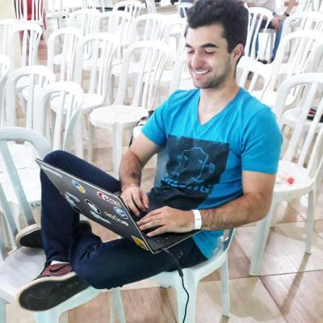

# Sobre

Projeto da disciplina Gerência, Configuração e Evolução de Software da Universidade de Brasília do semestre 2020-2, que consiste em aplicar práticas da engenharia de software na comunidade opensource RocketChat.

O [Rocket.Chat](https://github.com/RocketChat) é um Web Chat Server, desenvolvido em JavaScript, usando o framework Meteor full stack.

É uma ótima solução para comunidades e empresas que desejam hospedar seu próprio serviço de chat de forma privada ou para desenvolvedores que desejam construir e desenvolver suas próprias plataformas de chat.

# Time

<a href="https://github.com/djorkaeffalexandre">
  

    
  

</a>
<a href="https://github.com/orgs/Rocket-Chat-GCES/people/gdeusdara">
  

    
  

</a>
<a href="https://github.com/Mikhaelle">
  

    
  

</a>
<a href="https://github.com/sammyzord">
  

    
  

</a>
<a href="https://github.com/matheus-rn">
  

    
  

</a>
<a href="https://github.com/ritzare">
  

    
  

</a>

| Matrícula |                             Aluno |
|------------|----------------------------------|
| 16/0122996 | Guilherme Antonio Deusdará Banci |
| 15/0018673 |      Mikhaelle de Carvalho Bueno |
| 16/0015294 |                          Matheus |
| 16/0054389 |                    Samuel Borges |
|            |                      João Victor |

# Sprints

- [Sprint 1]()
- [Sprint 2]()
